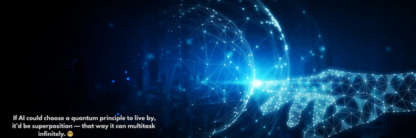

# Ayşe Yılmaz

**AI Developer | LLM Engineer | NLP | Quantum AI**

I develop production-grade AI applications with a focus on Large Language Models (LLMs), Retrieval-Augmented Generation (RAG), Multi-Agent Systems, and Intelligent Document Processing.

My current research explores the intersection of Artificial Intelligence and Quantum Computing, with a particular interest in Quantum Machine Learning, hybrid quantum-classical architectures, and efficient optimization techniques.

---

## Areas of Expertise

- Large Language Models (LLMs)
- Retrieval-Augmented Generation (RAG)
- Multi-Agent Systems
- Intelligent Document Processing
- OCR + LLM Pipelines
- Prompt Engineering
- FastAPI
- LangChain
- Hugging Face
- OpenAI API
- Neo4j
- Vector Databases
- Quantum Machine Learning

---

## Current Focus

- Production-ready LLM applications
- Agentic AI workflows
- Parameter-Efficient Fine-Tuning (PEFT)
- Quantum Machine Learning with Qiskit and PennyLane
- Hybrid Classical–Quantum AI Systems

---

## Technology Stack

### Languages
Python • C# • SQL • JavaScript

### AI & Machine Learning
PyTorch • TensorFlow • scikit-learn • LangChain • Hugging Face • OpenAI API

### Quantum Computing
Qiskit • PennyLane

### Backend
FastAPI • Django • REST APIs • Streamlit

### Databases
Neo4j • PostgreSQL • MySQL

### Cloud & DevOps
AWS • Azure • Google Cloud • Git • GitHub Actions

---

## Featured Projects

- AI-powered Document Processing
- Multi-Agent Banking Automation
- Retrieval-Augmented Generation (RAG)
- Quantum Computing Experiments
- LLM Applications

---

## GitHub Statistics

---

> *"Nature isn't classical, and if you want to make a simulation of nature, you'd better make it quantum."*
>
> **— Richard P. Feynman**
